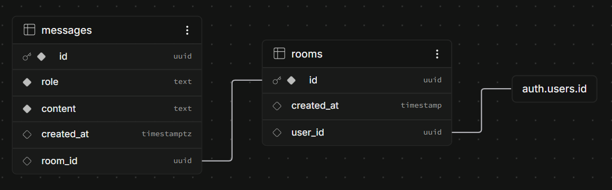

# [OpenAI API를 활용한 간단한 채팅 서비스 - ChitChat]

### 프로젝트 소개

OpenAI API를 사용하여 진행한 개인 프로젝트입니다.  
백엔드를 따로 개발한 이유는 프론트엔드는 API 응답만 받아서 사용하기 때문에, 그 이면에서 요청이 어떻게 처리되고 DB와 연동되는지 흐름이 궁금했기 때문입니다.  
FastAPI로 개발했고, Supabase로 로그인 인증과 데이터베이스 역할을 하고 있습니다.  
배포는 Railway를 통해서 배포했습니다.

개발 기간 : 2026.02 - 2026.06 (고도화 계획 중)

고도화 계획
- [ ] room_id / message_id 소유권 검증 추가 (다른 사용자의 방, 메시지 접근 방지)
- [x] API rate limiting 적용 (한 사용자가 무한정으로 OpenAI 호출 방지)
- [ ] 메시지 내역 조회시 최대 N개만 가져오도록 개선
- [ ] 응답 스트리밍 지원(SSE/WebSocket) 지원 - 답변이 생성되는 대로 조금씩 전달

### 주요 기능

- Bearer 토큰 기반 사용자 인증 (Supabase Auth)
- 룸(room) 단위 채팅 — 대화 맥락 최근 20개 메시지 유지
- OpenAI GPT-4o-mini를 활용한 AI 응답 생성
- 메시지 저장 및 삭제

### 개발 환경 설정

1. 필요 버전
- Python 3.10 이상
- Supabase
- OpenAI API 키

2. 설치
```bash
# 깃헙 repository 클론
git clone <repository-url>
cd chitchat

# 가상환경 생성 및 활성화
python -m venv venv
venv\Scripts\activate        # Windows
source venv/bin/activate     # macOS / Linux

# 의존성 설치
pip install -r requirements.txt
```

3. 환경 변수 설정

프로젝트 루트에 `.env` 파일을 생성하고 아래 값을 채웁니다.
```env
OPENAI_API_KEY=sk-...
SUPABASE_URL=https://<project-id>.supabase.co
SUPABASE_KEY=<service-role-key>
ALLOWED_ORIGINS=http://localhost:5173
```

> `ALLOWED_ORIGINS`에 여러 출처를 허용할 경우 쉼표로 구분합니다.  
> e.g. `http://localhost:5173,https://example.com`

4. 실행

```bash
uvicorn main:app --reload
# http://localhost:8000
```

### API

모든 엔드포인트는 `Authorization: Bearer <token>` 헤더가 필요합니다.

#### POST /chat

메시지를 전송하고 AI 응답을 받습니다.

**Request body**
```json
{
  "message": "안녕하세요",
  "room_id": "room-uuid"
}
```

**Response**
```json
{
  "ai_message": "안녕하세요! 무엇을 도와드릴까요?"
}
```

#### DELETE /messages/{message_id}

특정 메시지를 삭제합니다.

**Response**
```json
{
  "message": "deleted"
}
```

### 데이터베이스 스키마



### 기술 스택

[ Framework ] - FastAPI  
[ AI ] - OpenAI GPT-4o-mini  
[ 데이터베이스 ] - Supabase (PostgreSQL)  
[ 인증 ] - Supabase Auth + HTTP Bearer  
[ Deploy ] - Railway 

### 프로젝트 구조

```
chitchat/
├── main.py           # API 라우터, 인증, 비즈니스 로직
├── requirements.txt  # 의존성 목록
└── .env              # 환경 변수
```
